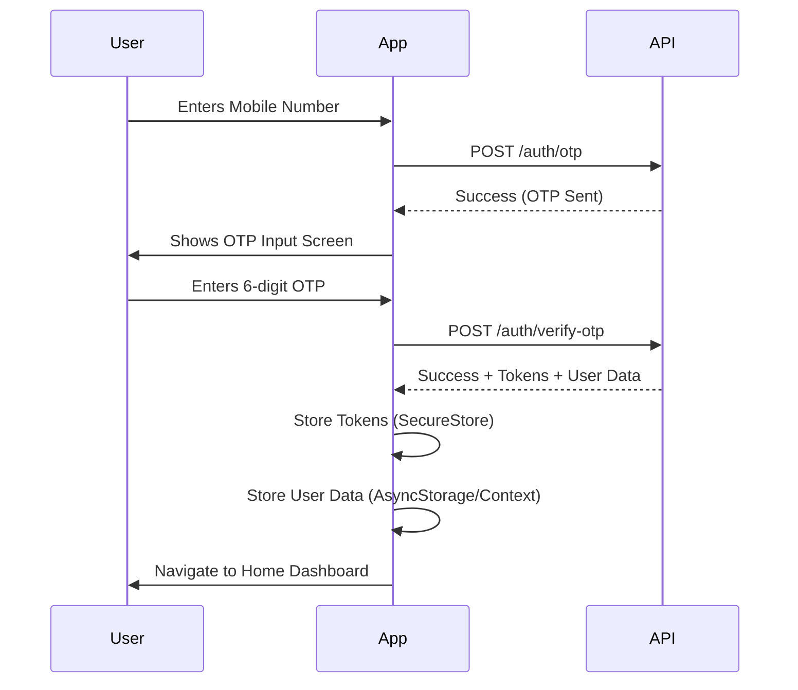
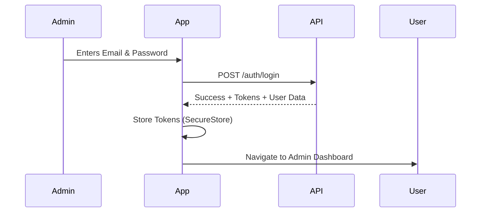

# Login System Documentation & Implementation Guide

## Overview
This document outlines the authentication mechanisms for the Visitor Management System and provides a guide for implementing the login flow in the React Native mobile application.

## Authentication Types
The system supports two types of authentication based on user roles:

1.  **Password Login**: 
    - **Target Users**: System Administrators (`SUPER_ADMIN`, `SOCIETY_ADMIN`).
    - **Method**: Email/Mobile + Password.
    - **Security**: Restricted to admin roles.

2.  **OTP Login**:
    - **Target Users**: Residents, Security Personnel.
    - **Method**: Mobile Number + One Time Password (OTP).
    - **Security**: Admin roles are **blocked** from using this method.

---

## API Endpoints (`/api/v1/auth`)

### 1. Request OTP (Mobile Users)
Initiates the login process for Residents/Security.

- **Endpoint**: `POST /auth/otp`
- **Body**:
  ```json
  {
    "mobile": "9876543210"
  }
  ```
- **Response**:
  ```json
  {
    "success": true,
    "message": "OTP sent successfully",
    "data": {
      "mobile": "9876543210",
      "expiresIn": "10 minutes"
      // "otp": "123456" // (Only in Development)
    }
  }
  ```

### 2. Verify OTP & Login
Completes authentication for Residents/Security.

- **Endpoint**: `POST /auth/verify-otp`
- **Body**:
  ```json
  {
    "mobile": "9876543210",
    "otp": "123456"
  }
  ```
- **Response**:
  ```json
  {
    "success": true,
    "message": "OTP verified successfully",
    "data": {
      "user": {
        "id": 1,
        "name": "John Doe",
        "role": "RESIDENT",
        ...
      },
      "accessToken": "ey...",
      "refreshToken": "ey..."
    }
  }
  ```

### 3. Admin Login (Password)
Direct login for Administrators.

- **Endpoint**: `POST /auth/login`
- **Body**:
  ```json
  {
    "email": "admin@example.com",
    "password": "secretpassword"
  }
  ```
- **Response**: Similar to OTP Login (returns user + tokens).

### 4. Refresh Token
Get a new access token when the old one expires.

- **Endpoint**: `POST /auth/refresh-token`
- **Body**:
  ```json
  {
    "refreshToken": "ey..."
  }
  ```

### 5. Logout
Invalidate the user's session.

- **Endpoint**: `POST /auth/logout`
- **Headers**: `Authorization: Bearer <access_token>`
- **Body** (Optional, for specific device logout):
  ```json
  {
    "refreshToken": "ey..."
  }
  ```

---

## React Native Implementation Guide

### 1. User Flows

#### Resident/Security Login (OTP Flow)


#### Admin Login (Password Flow)


### 2. Required Screens

1.  **Welcome Screen**
    - Options: "Login as Resident/Security" (Default) vs "Login as Admin".
2.  **Mobile Input Screen** (For OTP Flow)
    - Input: Mobile Number.
    - Action: "Get OTP".
3.  **OTP Verification Screen**
    - Input: 6-digit PIN.
    - Action: "Verify & Login".
    - Info: Timer for resend.
4.  **Admin Login Screen**
    - Inputs: Email, Password.
    - Action: "Login".

### 3. Service Layer Example (Axios)

```javascript
// src/services/authService.js
import axios from 'axios';
import * as SecureStore from 'expo-secure-store'; // or @react-native-async-storage/async-storage

const API_URL = 'http://YOUR_API_URL/api/v1/auth';

export const requestOtp = async (mobile) => {
  try {
    const response = await axios.post(`${API_URL}/otp`, { mobile });
    return response.data;
  } catch (error) {
    throw error.response?.data || error.message;
  }
};

export const verifyOtp = async (mobile, otp) => {
  try {
    const response = await axios.post(`${API_URL}/verify-otp`, { mobile, otp });
    const { accessToken, refreshToken, user } = response.data.data;
    
    // Store tokens securely
    await SecureStore.setItemAsync('accessToken', accessToken);
    await SecureStore.setItemAsync('refreshToken', refreshToken);
    
    return user;
  } catch (error) {
    throw error.response?.data || error.message;
  }
};

export const loginAdmin = async (email, password) => {
  try {
    const response = await axios.post(`${API_URL}/login`, { email, password });
    const { accessToken, refreshToken, user } = response.data.data;
    
    await SecureStore.setItemAsync('accessToken', accessToken);
    await SecureStore.setItemAsync('refreshToken', refreshToken);
    
    return user;
  } catch (error) {
    throw error.response?.data || error.message;
  }
};
```

### 4. Recommended Dependencies
- `axios`: For API requests.
- `expo-secure-store` or `react-native-keychain`: For storing sensitive tokens.
- `@react-navigation/native`: For screen navigation.
- `react-hook-form`: (Optional) For form management.

### 5. Error Handling Notes
- **Admin attempting OTP**: API returns 403. Handle this by showing "Admins must use Password Login".
- **Resident attempting Password**: API returns 403. Handle by showing "Please use OTP Login".
- **Account Blocked**: API returns 403. Show "Contact Administrator".
