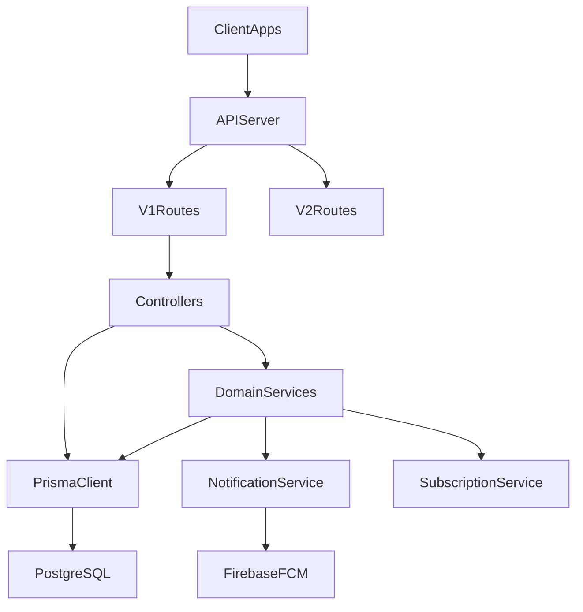

## Goal

Bring the existing Express + Prisma visitor management API to a more "enterprise-grade" level across architecture, security, robustness, and developer experience while preserving current functionality.

## Current Architecture Snapshot

- **Runtime & framework**: Node.js (ESM), Express 5, Prisma + PostgreSQL, Swagger for docs.
- **Structure**:
  - Entrypoints: `[server.js](C:/Users/parma/OneDrive/Desktop/visitorAPI/visitorManagementSystemAPI/server.js)`, `[app.js](C:/Users/parma/OneDrive/Desktop/visitorAPI/visitorManagementSystemAPI/app.js)`.
  - Routing: versioned trees under `[routes/v1](C:/Users/parma/OneDrive/Desktop/visitorAPI/visitorManagementSystemAPI/routes/v1)` and `[routes/v2](C:/Users/parma/OneDrive/Desktop/visitorAPI/visitorManagementSystemAPI/routes/v2)`.
  - Controllers hold most business logic (e.g. `[controllers/v1/visitorController.js](C:/Users/parma/OneDrive/Desktop/visitorAPI/visitorManagementSystemAPI/controllers/v1/visitorController.js)`).
  - Limited service layer (notifications, subscriptions, Firebase, maintenance) under `[services](C:/Users/parma/OneDrive/Desktop/visitorAPI/visitorManagementSystemAPI/services)`.
  - Prisma client in `[lib/prisma.js](C:/Users/parma/OneDrive/Desktop/visitorAPI/visitorManagementSystemAPI/lib/prisma.js)` with schema in `[prisma/schema.prisma](C:/Users/parma/OneDrive/Desktop/visitorAPI/visitorManagementSystemAPI/prisma/schema.prisma)`.
- **Cross-cutting**:
  - Auth & RBAC via `[middleware/auth.js](C:/Users/parma/OneDrive/Desktop/visitorAPI/visitorManagementSystemAPI/middleware/auth.js)` and `[utils/jwt.js](C:/Users/parma/OneDrive/Desktop/visitorAPI/visitorManagementSystemAPI/utils/jwt.js)`.
  - Audit logging via `[utils/auditLogger.js](C:/Users/parma/OneDrive/Desktop/visitorAPI/visitorManagementSystemAPI/utils/auditLogger.js)`.
  - Notifications via `[utils/notificationHelper.js](C:/Users/parma/OneDrive/Desktop/visitorAPI/visitorManagementSystemAPI/utils/notificationHelper.js)` and `[services/firebaseService.js](C:/Users/parma/OneDrive/Desktop/visitorAPI/visitorManagementSystemAPI/services/firebaseService.js)`.
  - Subscription/cron pieces exist but are not consistently enforced.

### High-Level Component Diagram

## 1) Architecture & Code Organization

**Objective**: Move towards a clean, layered architecture that separates HTTP, domain logic, and persistence, making it easier to extend, test, and enforce cross-cutting concerns.

- **Introduce a consistent service layer per domain**
  - Create services for key domains: Visitors, VisitorLogs, Approvals, PreApprovals, Units/Societies, Users/Authentication.
  - Migrate heavy logic out of controllers (e.g. from `visitorController`, `visitorLogController`, `approvalController`, `preApprovalController`) into services so controllers become thin HTTP adapters.
  - Standardize function contracts (DTO in/out) and avoid mixing `req/res` objects inside business logic.
- **Standardize repository/DB access patterns**
  - Keep Prisma usage centralized in a limited set of repository modules or inside services (no ad hoc `prisma.`\* calls sprinkled everywhere).
  - Define a shared `prisma` wrapper for transactions and common patterns (pagination, soft deletes if needed, audit logging hooks).
- **Consolidate common middleware and utilities**
  - Create shared middlewares for validation, error translation, and role checks instead of re-implementing the same `handleValidationErrors` logic in each route file.
  - Centralize sequence-fixing and base64 normalizations (from `utils/sequenceFix.js`, `utils/image.js`) and make them explicit in domain services.
- **Clarify versioning strategy (v1 vs v2)**
  - Decide if `v2` will be a true next-gen surface. If yes, start by porting a small, critical subset (e.g. auth + visitors) with the new layered style, using `v1` as “legacy”.
  - Document deprecation / migration path in Swagger and README.

## 2) Security & Compliance Hardening

**Objective**: Close the biggest security gaps (secrets, OTP, CORS, rate limiting) to be comfortable in production / enterprise environments.

- **Secrets & credentials**
  - Ensure **no Firebase service account JSON** is stored in git (currently `config/firebase-service-account.json` is present). Move to environment-based secrets (file mounted at runtime or JSON in env var) and update `firebaseService` to never load a checked-in key.
  - Enforce a non-default `JWT_SECRET` and fail fast if it’s missing instead of falling back to `'super_secret_key'`.
- **Authentication & OTP flows**
  - In `authController`, remove `isDevelopment = true` and ensure OTP values are **never** returned in API responses in production.
  - Add rate limiting on login and OTP endpoints (e.g. IP + mobile number) to mitigate brute force and enumeration.
  - Consider adding account lockout / cooldown policies and logging suspicious behavior to audit trails.
- **Authorization enforcement**
  - Audit all routes to ensure RBAC (`authorize`) is consistently enforced, especially for any admin-only management endpoints.
  - Add high-level tests (or at least manual checks initially) that verify unauthorized roles cannot access restricted endpoints.
- **CORS & network boundaries**
  - Replace global `cors()` usage with a configurable allowlist for origins (ideally environment-specific) and tighten allowed methods/headers.
- **Data exposure & error messages**
  - Replace direct exposure of `error.message` with sanitized error codes/messages, especially for authentication and DB errors.
  - Introduce a consistent error object format and mapping from internal errors to client responses.

## 3) Validation, Error Handling & API Consistency

**Objective**: Provide a predictable, well-documented API surface with uniform validation and error envelopes.

- **Central validation pipeline**
  - Wrap `express-validator` usage in a shared helper/middleware module.
  - Define reusable validators for common entities: IDs, phone numbers, dates/time windows, pagination.
  - Ensure all controllers trust validated data (and remove redundant re-validation).
- **Global error handling**
  - Expand the global error handler in `app.js` into a central translator:
    - Map known domain errors (e.g. `NotFoundError`, `ForbiddenError`, `ValidationError`) to consistent HTTP codes and JSON shapes.
    - Log unexpected errors with full context while returning sanitized messages.
- **Standard response schema**
  - Define and document a response format (e.g. `{ success, data, error }`) and gradually refactor controllers to conform.
  - Update Swagger definitions under `swagger/` to match the actual, standardized response structures.

## 4) Testing & Quality Gates

**Objective**: Add a minimal but meaningful test harness and CI hooks so changes are safe and regressions are caught.

- **Testing foundation**
  - Choose a test framework (e.g. Jest or Vitest) and add configuration plus scripts to `package.json`.
  - Add unit tests for pure services (once they are extracted) and integration tests for core flows:
    - Visitor CRUD
    - Visitor log check-in/check-out
    - Resident approval / rejection flow
    - Pre-approval code flow
- **Testable architecture**
  - Use dependency injection (or at least clear boundaries) for services that rely on `prisma`, `firebaseService`, and notification helpers so they can be mocked in tests.
- **Continuous Integration**
  - Introduce a simple CI pipeline (GitHub Actions or equivalent) that runs tests, lints, and Prisma format/validate on every PR.

## 5) Observability, Monitoring & Operations

**Objective**: Make the system observable in production and robust under multi-instance deployments.

- **Structured logging**
  - Replace ad hoc `console.log` usage with a structured logger (e.g. pino, Winston) and a standard log format.
  - Include request IDs/correlation IDs, user IDs, and key domain identifiers (visitorId, visitorLogId) where relevant.
- **Metrics & health**
  - Add basic health and readiness endpoints (DB connectivity, Prisma client health, Firebase connectivity).
  - Plan for metrics (Prometheus/OpenTelemetry or a simple hosted solution) to track request rates, error rates, and notification failures.
- **Cron & background jobs**
  - Review cron jobs in `utils/subscriptionCron.js` and `scripts/cronJobs.js` to avoid duplicate execution across multiple instances.
  - If needed, centralize scheduled jobs in a single worker process or use a hosted scheduler (or at least add DB-based locking).

## 6) Subscription & Billing Domain

**Objective**: Make subscription checks reliable so that tenant status actually controls access as intended.

- **Enforce subscription middleware**
  - Wire `middleware/subscription.js` into the route tree where appropriate (e.g. protect all `/v1` business endpoints except auth/health).
  - Define clear behavior for expired vs trial vs active states and update controllers/services to respect it.
- **Subscription service improvements**
  - Consolidate subscription-related logic into `subscriptionService` and keep controllers thin.
  - Add audit logs for subscription changes and enforcement decisions.

## 7) API Documentation & Developer Experience

**Objective**: Make the API easy to discover and safe to integrate with.

- **Swagger/OpenAPI alignment**
  - Review and update existing Swagger definitions in `swagger/` to:
    - Reflect real request/response shapes and error formats.
    - Include security schemes (JWT bearer) and role/permission notes.
    - Document rate limits and OTP behavior.
- **Environment setup clarity**
  - Ensure `.env.example` is accurate and complete, including all required secrets, DB settings, Firebase config, and any feature flags.
  - Add a clear onboarding section to `README` for running the API locally (migrations, seeding, sample data).

## 8) Domain Features & Future Enhancements

**Objective**: Extend the product surface in ways that match a "high-level" visitor management system, once the foundation is solid.

- **Analytics & reporting**
  - Build reporting endpoints for visitor volume, peak hours, frequent visitors, unit-level visit history, and gate performance.
  - Support export (CSV/PDF) via async jobs if data volumes grow.
- **Notifications and escalation policies**
  - Extend notification flows to support escalation (e.g., if a resident does not respond to a pending approval within X minutes, auto-cancel or auto-escalate to admin).
  - Offer per-user preferences for push vs email/SMS (if you add email/SMS providers).
- **Multi-tenant / multi-society readiness**
  - Ensure all queries are correctly scoped by `societyId` and that there is no cross-tenant data leakage.
  - Add stronger invariants and tests that enforce tenant isolation.
- **API clients & SDKs**
  - Once the API surface stabilizes, consider small client SDKs (TypeScript, maybe mobile-focused) that wrap auth, visitor flows, and notifications for your frontends.
